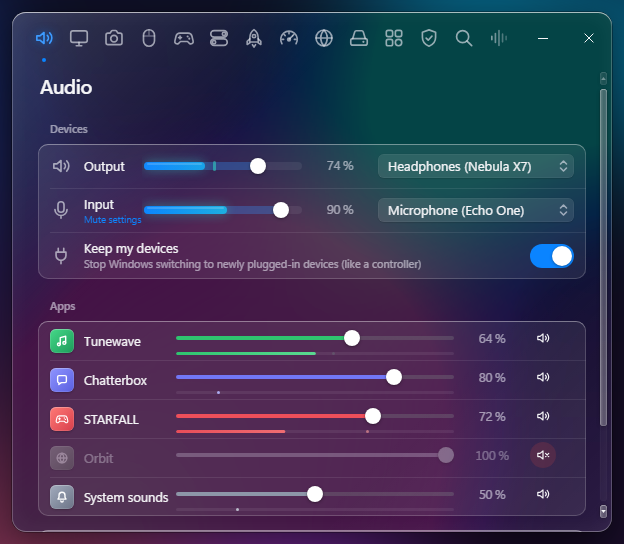
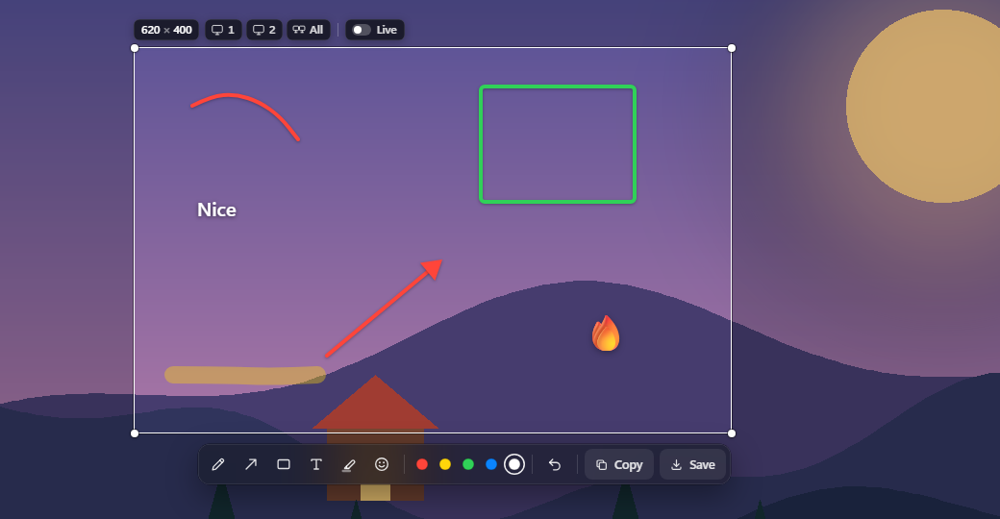
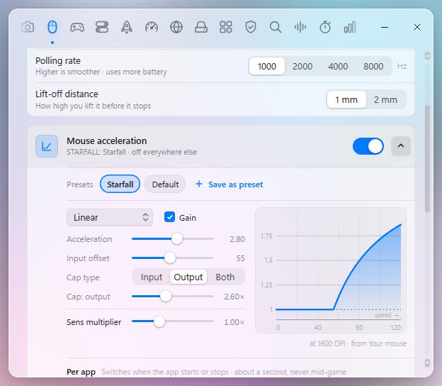
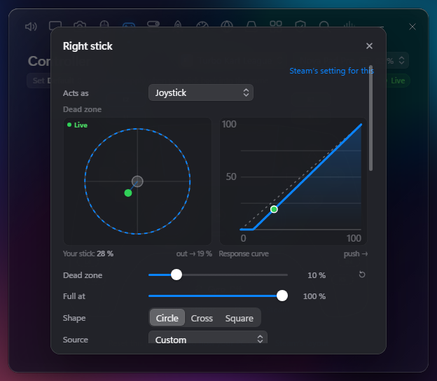
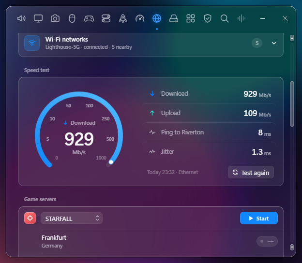
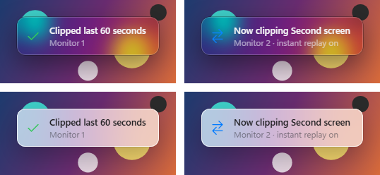

# Boyler Utilities

One clean glass menu in your tray for the Windows settings that are slow to find or buried, and it uses next to no CPU or memory while it's closed.

## What's in it

Double-click the tray icon and pick a tab.

- **Audio**: volume for every device and app in one place, mute your mic everywhere with one key, and stop Windows from switching to a newly plugged-in device.
- **Display**: resolution, refresh rate, scaling, main monitor, brightness, contrast and vibrance. Save presets, or switch one on by itself when a game starts.
- **Screenshots**: one key freezes the screen, then you drag an area, draw on it, and save or copy it. A gallery shows your recent shots.

  

- **Mouse**: pointer speed, cursors (a glass set is built in), size, and an acceleration curve per game. DPI, polling rate and battery for supported mice.
- **Keyboard**: a picture of your keyboard - click any key to remap it, give it an action or a macro. Optional key sounds (clean keyboard or satisfying ones) that never store what you type.

  

- **Controller**: click any button on the picture to change what it does in a Steam game. Dead zones, curves and a stick-drift check.

  

- **Tweaks**: dozens of hidden Windows switches (file extensions, the classic right-click menu, Game Mode, no ads or Widgets) and one-click quick fixes.
- **Startup**: everything that starts with Windows in one list. Switch anything off.
- **Performance**: live CPU, GPU, memory, disk and network, your PC's specs, and every running program with End task.
- **Network**: adapters, DNS, Wi-Fi, a speed test, and pings to a game's servers to find the best region.

  

- **Storage**: how full each drive is and how healthy it is, what is using the space, and a safe clean-up.
- **Apps**: every installed program with its size. Tick several and uninstall them in one go.
- **Security**: Microsoft Defender scans, threats and quarantine, and a drop zone to scan one file.
- **Search**: a fast search box for apps, folders and files (files come from the free Everything app, installed with one click).
- **Voice**: speak and your words appear as text, ready to copy (it uses Windows' own online dictation, the same one as Win+H).
- **Timers**: stopwatches, countdowns and a world clock that you can pin on screen.
- **Activity**: screen time, game time and your most-used apps. It's off until you turn it on, and nothing leaves your PC.
- **Add-ons**: extras you can download, like mouse acceleration and Notifications for OBS: a small glass popup and sound when OBS saves your clip.

  

- **Settings**: start with Windows, dark or light glass, every shortcut in one list, and undo for everything the app changed.

## Download

Get **[Boyler-Utilities-Setup.exe](https://github.com/oneboyler/boyler-utilities/releases/latest/download/Boyler-Utilities-Setup.exe)** from the [latest release](https://github.com/oneboyler/boyler-utilities/releases/latest) and run it. It installs just for you, so it needs no admin rights (only the optional Everything install for Search asks).

Made for Windows 11, 64-bit.

Updates: open Settings and click **Check for updates**. The app only goes online when you ask it to, or for things that need the internet (the speed test, game pings, voice to text, add-on downloads, installing Everything).

## Building from source

See [BUILDING.md](BUILDING.md). In short, install Rust (MSVC) and run `cargo build --release -p bu-app`.

## Contributing

Pull requests are welcome. Add a feature, fix a bug, make it better.

## License

MIT, see [LICENSE](LICENSE). Third-party licences are listed in the app under Settings > Licences.
